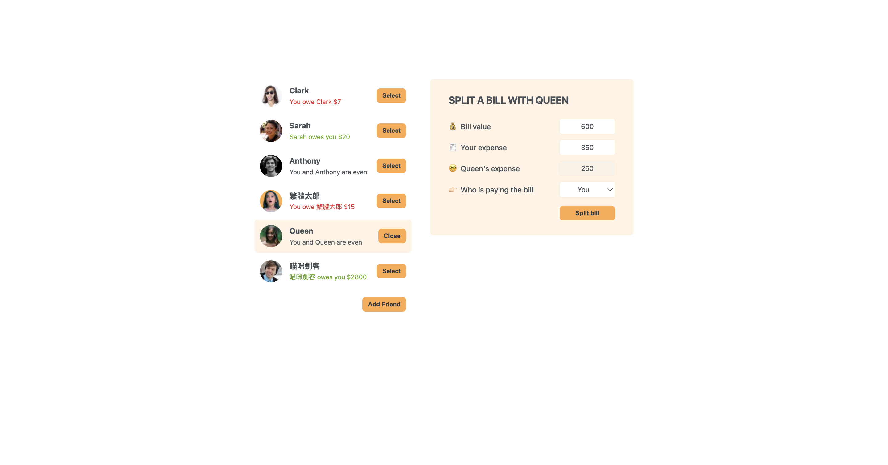

# Split bill - build with React

This is a exercise to build split bill application with React, helps users calculate and split expenses when going out with friends. Users can easily add friends to the list, and the simple interface makes it very user-friendly.

- Screenshot:
  

## Built with

- React

## Runs the app

```Shell
npm start
```

- Runs the app in the development mode.
- Open [http://localhost:3000](http://localhost:3000) to view it in your browser.

- The page will reload when you make changes.
- You may also see any lint errors in the console.

## Links

- Live Site URL: [live site URL here](https://splitwithfriend.netlify.app/)

## Author

- The Ultimate React Course 2024: React, Redux & More by Jonas Schmedtmann
- My GitHub - [YACodingroom](https://github.com/YAcodingroom)

## Acknowledgments

- Ivy & Ciao
- YAL me
- Dr.Angela & Jonas
